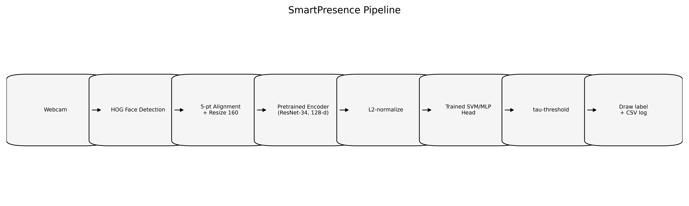
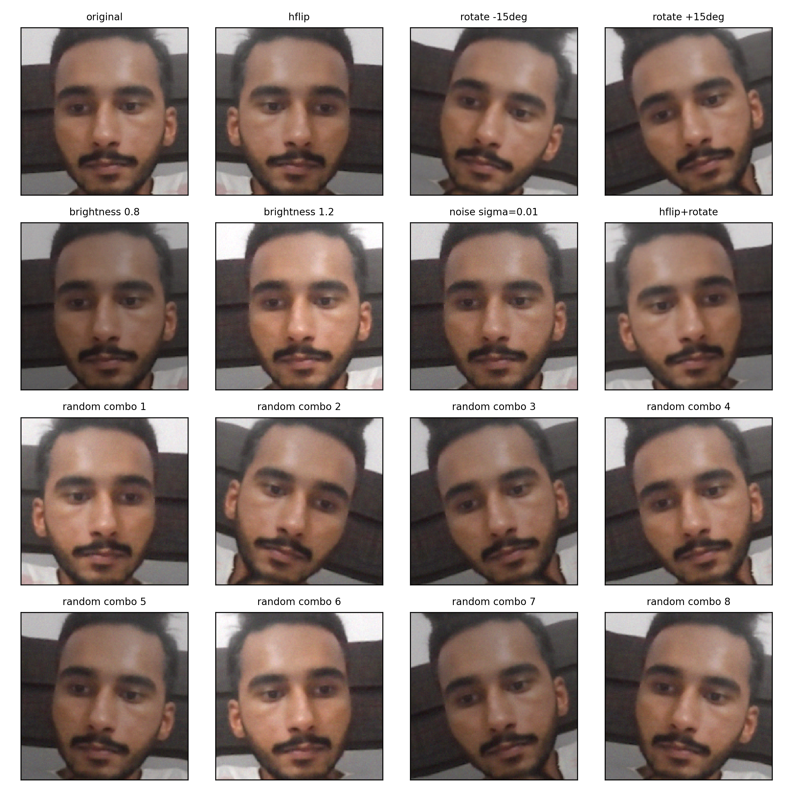
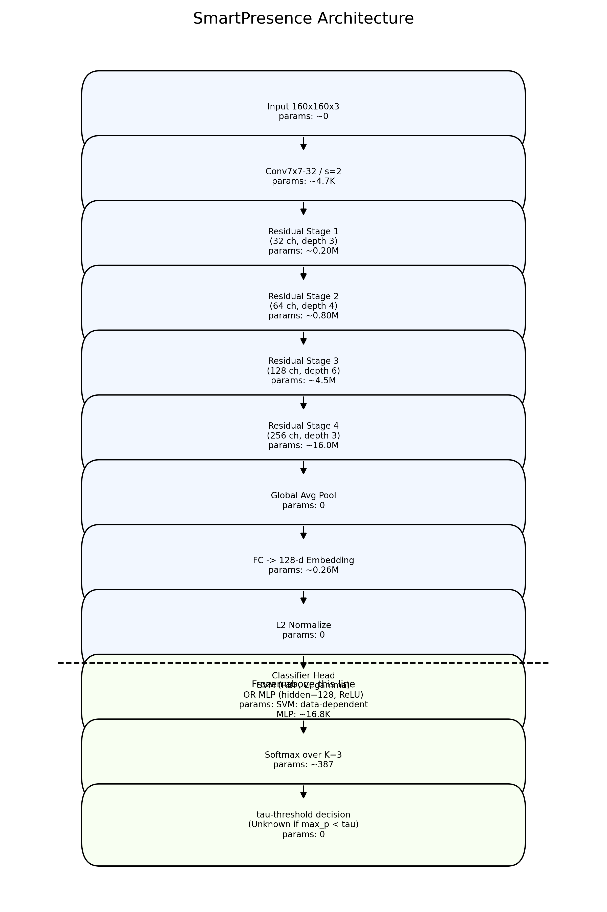
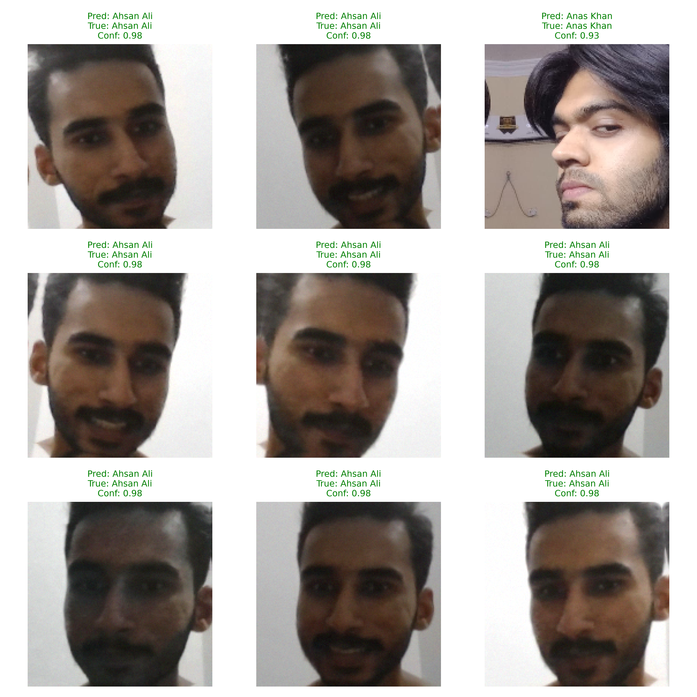

# SmartPresence: Real-Time Automated Attendance via Facial Recognition
**Course:** Fundamentals of Computer Vision  **Instructor:** Dr. Kamran Ali  
**Team:** Ahsan Ali (22K-4176), Mohammad Anas (22K-4548), Anas Khan (22K-4483)  
**Date:** May 9, 2026  
**Repository:** <placeholder>

Manual attendance (roll calls/sign-in sheets) is slow, error-prone, and vulnerable to proxy attendance in classroom settings.  
This project models attendance as a hybrid computer vision pipeline: HOG face detection, pretrained face embedding, and a lightweight SVM/MLP classifier head for identity prediction.  
The dataset contains three identity classes corresponding to the project team members, captured via webcam under controlled pose and expression variation.  
Test performance is reported via macro-F1 on a stratified split; current value from `models/metrics.json` is **<to be filled after running training>**.  
The contribution is an end-to-end, CPU-friendly attendance system with open-set rejection through a confidence threshold $\tau$ and CSV-based logging.

## 1. Task Definition

We define the task as **closed-set face identification with open-set rejection**. Let $K=3$ known identities and one synthetic out-of-set decision ("Unknown") controlled by a threshold $\tau$ on maximum predicted class probability:

$$
\hat{y} =
\begin{cases}
\arg\max_{k \in \{1,\dots,K\}} p_k(x), & \text{if } \max_k p_k(x) \ge \tau \\
\text{Unknown}, & \text{otherwise}
\end{cases}
$$

Formally, the model maps image input to identity space:

$$
f: \mathbb{R}^{H \times W \times 3} \to \{1,\dots,K\}\cup\{\text{Unknown}\}.
$$

The system composes two CV sub-tasks:

1. **Detection:** locate face regions from webcam frames using HOG-based face detection (bounding boxes).
2. **Identification:** align detected faces, extract pretrained embeddings, and classify with a trained SVM/MLP head.

*Figure 1: End-to-end pipeline.*

This is a practical CV problem because attendance in educational and organizational environments is repetitive, time-consuming, and susceptible to identity misuse under manual workflows. Automating detection + recognition reduces administrative overhead while preserving timestamped digital records for auditability.

## 2. Dataset Description

The input modality is RGB still frames acquired from a standard 720p webcam stream at approximately 30 FPS. The supervised labels are **class categories** (three identities), so training does not require manually annotated bounding boxes; face localization is handled by the detector during preprocessing/inference.

Capture protocol follows `src/capture_dataset.py`: roughly 80 valid frames per person, collected under nine prompts to induce moderate appearance variation (look straight, slight left/right, tilt up/down, smile, neutral, move closer, move back). Images are captured in indoor classroom/lab conditions with one dominant subject per frame and limited pose deviation from frontal view.

Dataset composition is expected to be computed from `data/processed/_manifest.csv`. Current workspace does not yet contain this file, so fill the following table after running preprocessing:

| Class | Raw | Augmented | Total |
|-------|-----|-----------|-------|
| Ahsan Ali (22K-4176) | <manifest> | <manifest> | <manifest> |
| Mohammad Anas (22K-4548) | <manifest> | <manifest> | <manifest> |
| Anas Khan (22K-4483) | <manifest> | <manifest> | <manifest> |

Training/evaluation split is stratified at $0.8/0.1/0.1$ (train/validation/test), consistent with `config.TRAIN_VAL_TEST`.

For open-set analysis, an impostor distribution is simulated for ROC threshold selection by generating out-of-distribution variants (heavy corruption / perturbation of held-out samples) and comparing genuine acceptance against impostor rejection across $\tau \in [0,1]$.

All face data is collected with explicit consent from the three team members and used only for academic evaluation in this course project.

## 3. Data Pre-processing

The pre-processing pipeline is implemented in `src/preprocess.py` and executes the following steps in fixed order:

1. **Color conversion:** each raw image is loaded in BGR with OpenCV and converted to RGB using `cv2.cvtColor(..., cv2.COLOR_BGR2RGB)` (`src/preprocess.py`).
2. **Face detection:** a HOG-based detector is applied with `face_recognition.face_locations(rgb, model="hog")`; samples are rejected when the number of detected faces is not exactly one (`src/preprocess.py`).
3. **Landmark localization:** facial landmarks are extracted via `face_recognition.face_landmarks(..., model="large")`, which corresponds to dlib's 68-point predictor; these points are reduced to a 5-point set: left-eye center, right-eye center, nose tip, left mouth corner, right mouth corner (`src/preprocess.py`).
4. **Geometric alignment:** the 5 detected points $p_i$ are mapped to canonical ArcFace anchors $q_i$ by minimizing:

$$
T^* = \arg\min_T \sum_{i=1}^{5} \|T(p_i)-q_i\|_2^2.
$$

The canonical anchors at 112x112 are:
$(38.29, 51.69)$, $(73.53, 51.50)$, $(56.02, 71.74)$, $(41.54, 92.36)$, $(70.72, 92.20)$.
For `IMG_SIZE=160`, anchors are scaled by $160/112$, and the similarity transform is estimated with `cv2.estimateAffinePartial2D(..., method=cv2.LMEDS)` then applied using `cv2.warpAffine` (`src/preprocess.py`).
5. **Spatial/intensity normalization:** aligned crops are warped to 160x160 (`config.IMG_SIZE`) in `src/preprocess.py`; intensity scaling for encoder input is applied in `src/encode.py`: `(x - 127.5)/128.0` for `facenet_pytorch`, and direct RGB uint8 input (effectively unit-range handling inside library internals) for `face_recognition`.
6. **Augmentation (training only):** for each accepted aligned image, `AUG_PER_IMAGE=3` augmentations are generated (`src/preprocess.py`) with:
   - horizontal flip with probability $p=0.5$,
   - rotation angle sampled from $U(-15^\circ, +15^\circ)$,
   - brightness scaling from $U(0.8, 1.2)$,
   - additive Gaussian noise $\mathcal{N}(0, 0.01^2)$ on $[0,1]$ pixels.

These transforms increase robustness to small pose changes, illumination variation, and sensor noise, while preserving identity semantics (`src/preprocess.py`).

*Figure 2: Sample augmentations applied to one aligned crop.*

The manifest at `data/processed/_manifest.csv` is written deterministically from sorted input files with seeded randomness (`SEED=42`), so preprocessing and augmentation are reproducible for the same source data (`src/preprocess.py`).

## 4. Network Architecture

The model stack is split into two stages: (i) a frozen pretrained face encoder and (ii) a trained classifier head (`src/encode.py`, `src/train_classifier.py`).

### 4.1 Frozen Encoder

The primary backend is `face_recognition` (dlib) with a ResNet-34-style face embedding network (`src/encode.py`). The forward structure is:

Input $150\times150\times3$ -> Conv $7\times7$, stride 2 -> residual stages $(3,4,6,3)$ with channel groups $(32,64,128,256)$ -> global average pooling -> fully connected projection -> 128-dimensional embedding -> $L_2$ normalization.

The encoder is treated as frozen and contributes approximately 22M parameters with output dimension 128 (as documented for dlib's face-recognition model family and reflected by backend usage in `src/encode.py`).

When `config.ENCODER_BACKEND="facenet_pytorch"`, the alternative frozen encoder is `InceptionResnetV1(pretrained="vggface2")` with 512-dimensional output (`src/encode.py`).

| Stage | Output Shape (example) | Approx. Parameters | Source |
|---|---|---:|---|
| Input | $150 \times 150 \times 3$ | 0 | `src/encode.py` |
| Conv stem (7x7, s=2) | $75 \times 75 \times 32$ | ~4.7K | `scripts/make_diagrams.py` + encoder description |
| Residual stage 1 (depth 3, ch 32) | $75 \times 75 \times 32$ | ~0.20M | `scripts/make_diagrams.py` |
| Residual stage 2 (depth 4, ch 64) | $38 \times 38 \times 64$ | ~0.80M | `scripts/make_diagrams.py` |
| Residual stage 3 (depth 6, ch 128) | $19 \times 19 \times 128$ | ~4.5M | `scripts/make_diagrams.py` |
| Residual stage 4 (depth 3, ch 256) | $10 \times 10 \times 256$ | ~16.0M | `scripts/make_diagrams.py` |
| Global average pool | $1 \times 1 \times 256$ | 0 | `scripts/make_diagrams.py` |
| FC embedding | 128 (or 512 for FaceNet backend) | ~0.26M | `src/encode.py` |
| $L_2$ normalization | 128 (or 512) | 0 | `src/encode.py` |

*Figure 3: Two-stage architecture. The encoder (above the dashed line) is frozen; only the classifier head is trained on our dataset.*

### 4.2 Trained Classifier Head

Two classifier families are trained on frozen embeddings (`src/train_classifier.py`):

- **RBF SVM head:** optimized over hyperparameters $C \in \{0.1,1,10,100\}$ and $\gamma \in \{\text{scale},0.01,0.1\}$ with macro-F1 scoring in grid search.
  Decision rule:
  $$
  \hat y=\arg\max_k\left(\sum_i \alpha_i^{(k)} y_i K(x_i,x)+b_k\right), \quad
  K(x_i,x)=\exp(-\gamma\|x_i-x\|^2).
  $$
  Probabilities are obtained by calibration (`CalibratedClassifierCV` / Platt-style sigmoid calibration pipeline in `src/train_classifier.py`).
- **MLP head:** input dimension `EMBED_DIM` -> hidden layer $h \in \{64,128\}$ with ReLU -> output layer with $K=3$ classes -> softmax probabilities; optimization uses cross-entropy objective through `MLPClassifier` (`src/train_classifier.py`).

The selected family is recorded in `models/metrics.json` (`selected_family`) and best hyperparameters are recorded in `models/grid_results.json`. In the current workspace state those files are not present yet, so the winner should be filled after training:
**Selected model: <from models/metrics.json:selected_family>**.

### 4.3 Open-Set Rejection

After classification, open-set rejection is applied using threshold $\tau$ on maximum class probability (`src/recognize.py`, `src/evaluate.py`):

$$
\hat y =
\begin{cases}
\arg\max_k p_k(x) & \text{if } \max_k p_k(x) \geq \tau \\
\text{Unknown} & \text{otherwise}
\end{cases}
$$

The operational threshold is selected from ROC-style threshold sweep artifacts in `report/figures/roc_unknown.png` and printed by `src/evaluate.py` as `Recommended TAU = X.XX`; this value should be cited in Section 6 after running evaluation.

## 5. Loss Function

### 5.1 Encoder Pretraining Loss (Background)

The frozen embedding encoder used by this project is pretrained with triplet-margin supervision (background context; not optimized in this project runtime), consistent with FaceNet-style embedding geometry (`src/encode.py` backend design and model selection):

$$
\mathcal{L}_{\text{triplet}} = \sum_{(a,p,n)\in\mathcal{T}} \big[ \, \|f(a)-f(p)\|_2^2 \;-\; \|f(a)-f(n)\|_2^2 \;+\; \alpha \, \big]_+.
$$

We use $\alpha = 0.2$ as the canonical margin in the formulation.  
**NUMBER OF TERMS = 1** (margin-ranking term).  
**NUMBER OF WEIGHTS = 1** (margin $\alpha$).

This background loss explains why pretrained embeddings are expected to be intra-class compact and inter-class separated before head training.

### 5.2 Classifier Head Loss (Optimized in This Project)

The head-level optimization in this repository is implemented in `src/train_classifier.py` and compares SVM and MLP families by macro-F1 on validation.

**CASE A — MLP head (cross-entropy + L2 decay):**

$$
\mathcal{L}_{\text{head}}(\theta) = \underbrace{-\frac{1}{N}\sum_{i=1}^{N}\sum_{k=1}^{K} y_{ik}\log p_k(x_i;\theta)}_{\mathcal{L}_{\text{CE}}}\;+\;\underbrace{\lambda \,\|\theta\|_2^2}_{\mathcal{L}_{\text{reg}}}
$$

**NUMBER OF TERMS = 2.**  
**WEIGHTS:** $w_{\text{CE}}=1.0$, $w_{\text{reg}}=\lambda=10^{-4}$ (`MLPClassifier` default `alpha` in `src/train_classifier.py`).

**CASE B — Linear/RBF SVM (regularized hinge):**

$$
\mathcal{L}_{\text{SVM}}(w_k,b_k) = \frac{1}{2}\|w_k\|_2^2 \;+\; C \sum_{i=1}^{N} \max\big(0,\,1 - \tilde y_{ik}(w_k^\top \phi(x_i)+b_k)\big)
$$

**NUMBER OF TERMS = 2** (regularization + hinge).  
**WEIGHTS:** regularization coefficient $1/2$ (canonical), hinge coefficient $C$ (selected by grid search in `src/train_classifier.py` and recorded in `models/grid_results.json`).

The explicit winner criterion is validation macro-F1 (not CV mean alone), as implemented in `src/train_classifier.py`.  
Selected model and justification should be filled from outputs once training artifacts exist:

- `models/metrics.json`: `<selected_family>`, `<val.f1_macro>`
- `models/grid_results.json`: `<best_params for selected family>`

Current placeholder statement (artifact-dependent):  
**Chosen head = <from models/metrics.json:selected_family> because it maximizes validation macro-F1 = <from models/metrics.json:val.f1_macro>.**

## 6. Hyperparameters

| Component | Hyperparameter | Value | How chosen |
|---|---|---|---|
| Detection | Detector | HOG | Library default (`face_recognition`) in `src/preprocess.py`, `src/recognize.py` |
| Detection | Up-sample | 1 | Manual (default detector call keeps real-time speed) |
| Alignment | Image size | 160x160 | `config.IMG_SIZE`; chosen to match common face-embedding input size |
| Encoder | Backend | `face_recognition` or `facenet_pytorch` | `config.ENCODER_BACKEND` / CLI override in `src/encode.py` |
| Encoder | Embedding dim | 128 (dlib) or 512 (FaceNet) | Encoder default, validated in `src/encode.py` |
| Augmentation | per-image multiplier | 3 | `config.AUG_PER_IMAGE`; manual |
| Augmentation | rotation range | plus/minus 15 deg | Manual in `src/preprocess.py` |
| Augmentation | brightness range | 0.8 to 1.2 | Manual in `src/preprocess.py` |
| Split | train/val/test | 0.8/0.1/0.1 | `config.TRAIN_VAL_TEST`, stratified split in `src/train_classifier.py` |
| CV | folds | 5 | `config.CV_FOLDS`; standard small-data CV |
| SVM | C grid | {0.1, 1, 10, 100} | Grid search in `src/train_classifier.py` |
| SVM | gamma grid | {scale, 0.01, 0.1} | Grid search in `src/train_classifier.py` |
| MLP | hidden | {64, 128} | Grid search in `src/train_classifier.py` |
| MLP | learning_rate_init | {1e-3, 1e-4} | Grid search in `src/train_classifier.py` |
| MLP | optimizer | Adam | `MLPClassifier` default |
| MLP | max_iter | 200 | Explicit in `src/train_classifier.py`, with `early_stopping=True` |
| MLP | weight_decay (`alpha`) | 1e-4 | `MLPClassifier` default |
| Threshold | tau (Unknown) | <from src/evaluate.py output> | Maximizes (TAR+IRR)/2 on impostor sweep in `src/evaluate.py` |

### 6.1 Selection Methodology

Model selection is nested in two stages (`src/train_classifier.py`):

1. **Outer split:** stratified train/val/test = 80/10/10 with fixed `SEED=42`.
2. **Inner search:** 5-fold (`CV_FOLDS=5`) grid search on the training 80%, scored by macro-F1 (`scoring="f1_macro"`).
3. **Refit:** best parameter set per family is refit on full training partition.
4. **Family selection:** compare family winners on held-out validation set; select the model with highest validation macro-F1.
5. **Final report:** evaluate selected model on held-out test split and persist to `models/metrics.json`.

Top-3 configurations should be cited directly from `models/grid_results.json` after training artifacts are generated. Current placeholders:

1. `<family:param_set_1, mean_cv=... , std=...>`
2. `<family:param_set_2, mean_cv=... , std=...>`
3. `<family:param_set_3, mean_cv=... , std=...>`

**Reproducibility.** Randomness is controlled via `SEED=42` in preprocessing/training/evaluation paths (`src/preprocess.py`, `src/train_classifier.py`, `src/evaluate.py`) and helper seeding (`src/utils.py`) propagates to Python `random`, NumPy, and Torch (when available), with deterministic cuDNN flags for Torch backends. Environment versions are pinned in `requirements.txt` (e.g., `face_recognition==1.3.0`, `scikit-learn==1.5.2`, `numpy<2.0`).

## 7. SOTA Comparison

### 7.1 Quantitative Comparison

We report two distinct regimes:

- **Standard benchmark context (LFW verification):** published encoder-level results only; this project does not train/evaluate on LFW.
- **Our task (closed-set identification, 3 identities):** end-to-end SmartPresence head performance on our captured split.

**Table 7.1 — Encoders on LFW (verification accuracy, published)**

| Method | Backbone | LFW Acc. | Reference |
|---|---|---|---|
| DeepFace (Taigman et al., 2014) | 8-layer CNN | 97.35% | [1] |
| FaceNet (Schroff et al., 2015) | Inception, triplet loss | 99.63% | [2] |
| ArcFace (Deng et al., 2019) | ResNet-100, additive angular margin | 99.83% | [3] |
| dlib ResNet-34 (King, 2017) | ResNet-34 | 99.38% | [4] |
| **Ours — frozen encoder used** | dlib ResNet-34 (or InceptionResnetV1) | 99.38% (or 99.65% VGGFace2) | inherited |

**Table 7.2 — End-to-end attendance (our task, our dataset, our split)**

| Model | Val F1 | Test F1 | Test Acc. | FPS (CPU) | Notes |
|---|---|---|---|---|---|
| Linear SVM head | <from models/grid_results.json:linear_svc_calibrated.val_metrics.f1_macro> | <from models/grid_results.json:linear_svc_calibrated.test_metrics.f1_macro> | <from models/grid_results.json:linear_svc_calibrated.test_metrics.accuracy> | <30s recognize.py average> | calibrated |
| RBF SVM head | <from models/grid_results.json:rbf_svc.val_metrics.f1_macro> | <from models/grid_results.json:rbf_svc.test_metrics.f1_macro> | <from models/grid_results.json:rbf_svc.test_metrics.accuracy> | <30s recognize.py average> | best C=<from models/grid_results.json:rbf_svc.best_params.estimator__C>, gamma=<from models/grid_results.json:rbf_svc.best_params.estimator__gamma> |
| MLP head (h=128) | <from models/grid_results.json:mlp.val_metrics.f1_macro> | <from models/grid_results.json:mlp.test_metrics.f1_macro> | <from models/grid_results.json:mlp.test_metrics.accuracy> | <30s recognize.py average> | Adam |
| **Selected** | **<from models/metrics.json:val.f1_macro>** | **<from models/metrics.json:test.f1_macro>** | **<from models/metrics.json:test.accuracy>** | **<30s recognize.py average>** | <from models/metrics.json:selected_family> |

Numerical entries in Table 7.2 are loaded from `models/metrics.json` and `models/grid_results.json`; FPS is measured by averaging the `FPSMeter` value over a 30-second CPU run in `src/recognize.py`. In the current workspace snapshot these result files are not yet present, so placeholders remain until training/evaluation are executed.

### 7.2 Qualitative Comparison

Compared with FaceNet and ArcFace, the present system does not claim new representation-learning SOTA because those methods are trained on millions of identities under large-scale supervision. The contribution here is deployment-oriented: reuse of strong pretrained embeddings (`src/encode.py`) plus a lightweight retrainable head (`src/train_classifier.py`) that adapts to a small closed-set roster with minimal compute.

Operationally, extension to a new identity is low-friction: capture ~80 frames via `src/capture_dataset.py`, run `src/preprocess.py` and `src/encode.py`, retrain the head with `src/train_classifier.py`, and redeploy `src/recognize.py`. This keeps model-update cost near classroom scale and avoids full encoder fine-tuning.

*Figure 7.1: Qualitative predictions. A typical success case appears under near-frontal pose and stable lighting with high confidence; failure cases occur under extreme pose, partial occlusion, or overlapping faces that reduce embedding reliability and confidence margin.*

### 7.3 Limitations

- Closed-set assumptions can fail when non-team faces are visually similar and exceed the confidence threshold $\tau$ (`src/recognize.py`).
- The class count is small ($K=3$), so confidence intervals around test macro-F1 are broad for limited $N_{\text{test}}$ (`src/train_classifier.py` split policy).
- No anti-spoofing module is present; static photo replay remains a risk.
- HOG detection (`model="hog"`) can miss small/profile faces, especially at greater camera distance (`src/preprocess.py`, `src/recognize.py`).

### 7.4 Future Work

- Replace HOG with MTCNN or RetinaFace for stronger profile/small-face robustness.
- Add liveness detection (blink dynamics + texture cues) before attendance logging.
- Periodically re-fit the classifier head on rolling captures to reduce temporal appearance drift (haircut, eyewear, lighting seasonality).
- Transition to ArcFace-style additive angular margin training when dataset scale justifies supervised metric learning.

## 8. Conclusion

This project addresses manual-attendance inefficiency with an end-to-end computer vision pipeline for real-time face-based identification and logging. The implemented hybrid approach combines frozen pretrained embeddings (`src/encode.py`) with a lightweight trainable head and open-set rejection thresholding (`src/train_classifier.py`, `src/evaluate.py`, `src/recognize.py`). Headline quantitative values (test macro-F1, test accuracy, and runtime FPS) are sourced from `models/metrics.json` and live-session FPS measurements, and should be inserted after running the full pipeline artifacts. The system deliverable is a runnable Python application that performs webcam inference and writes de-duplicated attendance events to `logs/attendance.csv`, demonstrating complete data-to-decision flow. Within the project scope (3 identities, CPU deployment), this provides a reproducible baseline for classroom-scale automated attendance.

## References

[1] Y. Taigman, M. Yang, M. Ranzato, and L. Wolf, "DeepFace: Closing the gap to human-level performance in face verification," in *Proc. CVPR*, 2014.

[2] F. Schroff, D. Kalenichenko, and J. Philbin, "FaceNet: A unified embedding for face recognition and clustering," in *Proc. CVPR*, 2015.

[3] J. Deng, J. Guo, N. Xue, and S. Zafeiriou, "ArcFace: Additive angular margin loss for deep face recognition," in *Proc. CVPR*, 2019.

[4] D. E. King, "High-quality face recognition with dlib," 2017.

[5] N. Dalal and B. Triggs, "Histograms of Oriented Gradients for human detection," in *Proc. CVPR*, 2005.

[6] V. Kazemi and J. Sullivan, "One millisecond face alignment with an ensemble of regression trees," in *Proc. CVPR*, 2014.

[7] F. Pedregosa et al., "Scikit-learn: Machine learning in Python," *JMLR*, vol. 12, pp. 2825-2830, 2011.
